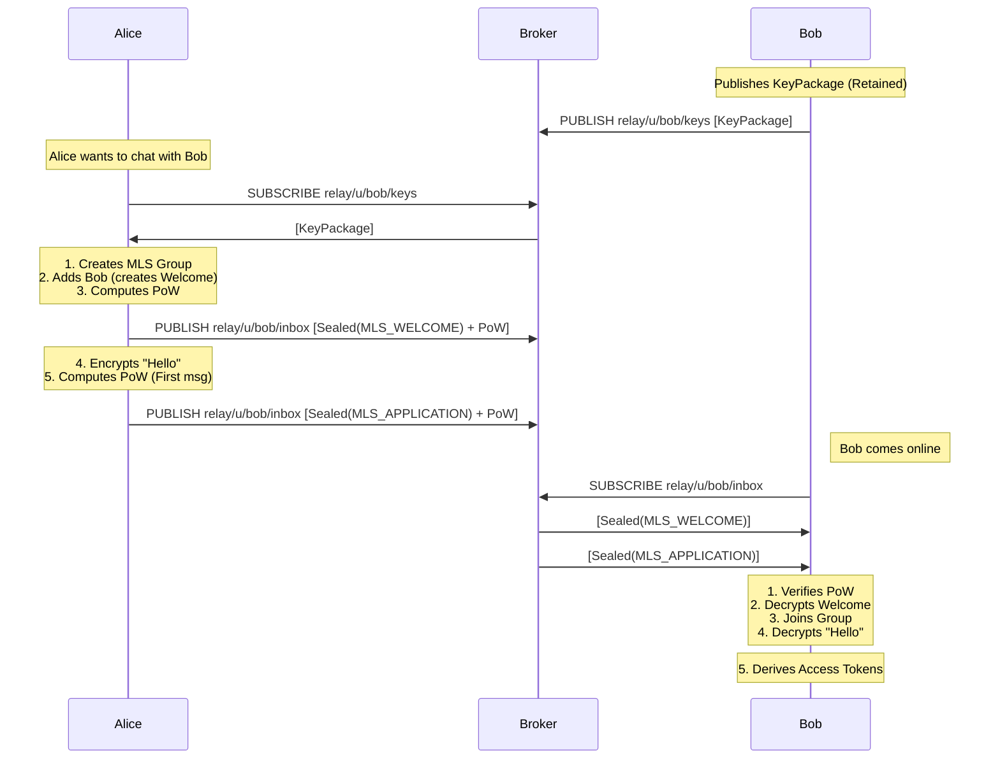
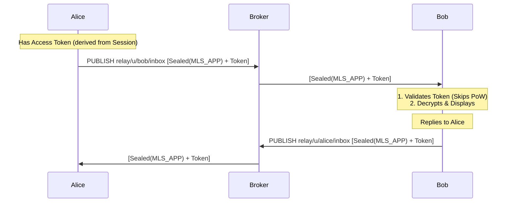
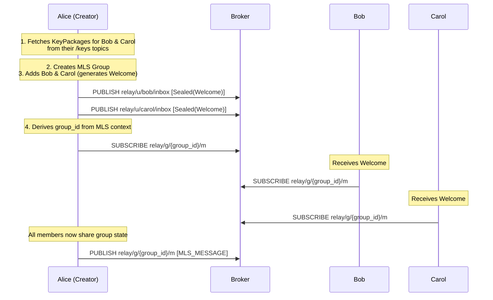

# RFC: Relay Protocol - Private Messaging over MQTT with MLS

## Abstract

This document specifies the Relay protocol, an end-to-end encrypted messaging protocol that maps the Messaging Layer Security (MLS) protocol [RFC 9420] onto MQTT 5.0. Relay acts as the **Delivery Service** for MLS, providing asynchronous messaging, metadata protection (Sealed Sender), and Denial-of-Service protections (Proof-of-Work) over an untrusted MQTT broker.

## Status of This Memo

This document specifies an Experimental protocol for the Internet community.

## Table of Contents

1. Introduction
   - 1.1. Design Goals
2. Conventions and Definitions
   - 2.1. Terminology
3. Architecture Overview
4. Trust Model
5. Topic Structure
   - 5.1. User Resources
   - 5.2. Group Resources
6. Cryptographic Primitives
   - 6.1. MLS Cipher Suite
   - 6.2. Sealed Sender Encryption
   - 6.3. Proof of Work (PoW)
   - 6.4. Access Tokens (Optimization)
7. Identity and Key Management
   - 7.1. User Identity
   - 7.2. KeyPackages (Prekeys)
8. Protocol Messages
   - 8.1. Wire Format (Relay Layer)
   - 8.2. Payload (Decrypted)
   - 8.3. Message Types
9. Connection Establishment
   - 9.1. Flow
   - 9.2. Connection Steps
10. Message Exchange
    - 10.1. Flow (Regular)
    - 10.2. Protocol
    - 10.3. Receiving Logic
11. Group Messaging
    - 11.1. Group Identifier
    - 11.2. Group Creation
    - 11.3. Sending Group Messages
    - 11.4. Receiving Group Messages
    - 11.5. Adding Members
    - 11.6. Removing Members
    - 11.7. State Synchronization
    - 11.8. Group Updates (Key Rotation)
    - 11.9. Differences from 1:1 Messaging
    - 11.10. Group Metadata Topic (Future Extension)
12. Security Considerations
    - 12.1. DoS Protection
      - 12.1.1. Threat Model
      - 12.1.2. PoW Mechanism
      - 12.1.3. Access Token Optimization
      - 12.1.4. Broker-Level DoS
    - 12.2. Metadata Privacy
      - 12.2.1. What the Broker Can See
      - 12.2.2. Traffic Analysis
      - 12.2.3. Comparison with Other Protocols
    - 12.3. MLS Security
      - 12.3.1. Forward Secrecy (FS)
      - 12.3.2. Post-Compromise Security (PCS)
      - 12.3.3. Authentication
      - 12.3.4. Integrity
      - 12.3.5. Deniability
13. IANA Considerations
14. References

## 1. Introduction

The Messaging Layer Security (MLS) protocol [RFC 9420] defines a continuous group key agreement protocol but relies on an abstract "Delivery Service" (DS) to route messages and order transactions. MQTT 5.0 [RFC 5001] is a widely deployed pub/sub protocol suitable for this role.

**Relay** defines how to transport MLS messages over MQTT 5.0, adding a privacy layer ("Sealed Sender") to hide sender identity from the broker and a Proof-of-Work (PoW) layer to mitigate Denial of Service attacks on public inboxes.

### 1.1. Design Goals

*   **MLS Delivery Service**: Implements the DS role for MLS (RFC 9420).
*   **Standard MQTT 5.0**: Uses Retained Messages for KeyPackages and QoS 1 for delivery.
*   **Metadata Protection**: Hides sender identity from the broker (augmenting MLS, which hides it from the group).
*   **Asynchronous Messaging**: Supports offline recipients via Prekeys (MLS KeyPackages).
*   **DoS Protection**: Computational Proof-of-Work for unsolicited messages.

## 2. Conventions and Definitions

The key words "MUST", "MUST NOT", "REQUIRED", "SHALL", "SHALL NOT", "SHOULD", "SHOULD NOT", "RECOMMENDED", "NOT RECOMMENDED", "MAY", and "OPTIONAL" in this document are to be interpreted as described in BCP 14 [RFC2119] [RFC8174].

### 2.1. Terminology

This document uses terminology from [RFC 9420] (MLS) and [RFC 5001] (MQTT).

*   **Delivery Service (DS)**: The role played by the MQTT Broker + Relay Topic Convention.
*   **KeyPackage**: An MLS KeyPackage (RFC 9420 Section 10).
*   **MLSMessage**: The wire format for MLS messages (RFC 9420 Section 6).
*   **Sealed Envelope**: A bespoke transport layer encryption to hide metadata from the DS.

## 3. Architecture Overview

Relay layers MLS over MQTT as follows:

```
+-------------------------------------------------------+
|                 Application Layer                     |
+-------------------------------------------------------+
|           MLS Protocol (RFC 9420)                     |
|  (Key Agreement, Forward Secrecy, Auth, Group State)  |
+-------------------------------------------------------+
|               Relay Privacy Layer                     |
|  (Sealed Sender, Proof-of-Work, Metadata Protection)  |
+-------------------------------------------------------+
|               MQTT 5.0 (Transport)                    |
|       (Routing, Pub/Sub, Reliability, Queuing)        |
+-------------------------------------------------------+
```

## 4. Trust Model

The Trust Model remains identical to the standard MLS Threat Model, with the specific instantiation that the **Delivery Service (MQTT Broker) is Untrusted**.

*   **Confidentiality**: Guaranteed by MLS (Content) and Relay Sealed Sender (Metadata).
*   **Integrity**: Guaranteed by MLS.
*   **Availability**: Provided by MQTT Broker (Best Effort / QoS 1).
*   **Ordering**:
    *   For 1:1 chats, the transcript hash enforces order.
    *   For Groups, the Broker acts as the sequencing point (Section 11).

## 5. Topic Structure

Relay maps MLS concepts to MQTT Topics.

### 5.1. User Resources

| Concept | MQTT Topic | MLS Mapping | QoS | Retain |
| :--- | :--- | :--- | :--- | :--- |
| **Inbox** | `relay/u/{user_id}/inbox` | Delivery Service (Push) | 1 | `false` |
| **Prekeys** | `relay/u/{user_id}/keys` | KeyPackage Directory | 1 | `true` |

### 5.2. Group Resources

| Concept | MQTT Topic | MLS Mapping | QoS | Retain |
| :--- | :--- | :--- | :--- | :--- |
| **Group Msgs** | `relay/g/{group_id}/m` | Delivery Service (Broadcast) | 1 | `false` |

## 6. Cryptographic Primitives

### 6.1. MLS Cipher Suite
Relay clients MUST support at least one defined MLS Cipher Suite (RFC 9420 Section 5.1).
*   Recommended: `MLS_128_DHKEMX25519_AES128GCM_SHA256_Ed25519` (Suite ID 0x0001).

### 6.2. Sealed Sender Encryption
(Layer below MLS). Uses `X25519` + `HKDF` + `AES-256-GCM` to encrypt the `Payload` to the recipient's Identity Key.

### 6.3. Proof of Work (PoW)
SHA-256 puzzle on the `SealedEnvelope` to cost-gate access to the `inbox`.

### 6.4. Access Tokens (Optimization)
To reduce the computational burden on mobile devices for active conversations, Relay supports **Access Tokens**.
*   **Definition**: A shared secret derived from the MLS session state (via `MLS-Exporter`) that authorizes a sender to bypass the PoW check.
*   **Derivation**: `Access_Token = MLS-Exporter("Relay-Access-Token", "", 16)` (RFC 9420 Section 8.5).
*   **Privacy**: Because tokens are derived from the rolling MLS epoch secret, they change frequently, preventing long-term linkability by the broker.
*   **Policy**: Recipients MAY require PoW for unknown senders while accepting Access Tokens from known peers.

## 7. Identity and Key Management

### 7.1. User Identity
A User ID is a 128-bit random value (hex-encoded).

### 7.2. KeyPackages (Prekeys)
To enable asynchronous start (RFC 9420 Section 11.1.1 "External Joins"), clients MUST publish a valid `KeyPackage` (RFC 9420 Section 10) to their `keys` topic.
*   The MQTT `RETAIN` flag ensures the KeyPackage is available to offline initiators.
*   Clients SHOULD rotate KeyPackages periodically to provide Forward Secrecy for the initial message.

## 8. Protocol Messages

### 8.1. Wire Format (Relay Layer)

```
SealedEnvelope = {
    0: uint,           ; version (1)
    1: bstr,           ; ephemeral_public_key (32 bytes)
    2: bstr,           ; encrypted_payload (AES-GCM)
    3: uint,           ; pow_nonce
    ? 4: bstr,         ; access_token (Optional, 16 bytes)
}
```

### 8.2. Payload (Decrypted)

The payload wraps the standard MLS message.

```
Payload = {
    0: uint,           ; msg_type (see below)
    1: bstr,           ; sender_user_id (16 bytes)
    2: bstr,           ; sender_identity_key (32 bytes)
    3: any             ; content (MLSMessage or custom)
}
```

*   **Rationale**: `sender_user_id` is required because `SealedEnvelope` hides it from the transport.

### 8.3. Message Types

| Type | Value | Content Structure | MLS Mapping |
| :--- | :--- | :--- | :--- |
| `MLS_WELCOME` | 3 | `Welcome` (RFC 9420 Sec 12.4.3.1) | Group Join |
| `MLS_MESSAGE` | 5 | `MLSMessage` (RFC 9420 Sec 6) | Application/Commit |

## 9. Connection Establishment

### 9.1. Flow



### 9.2. Connection Steps
Connection establishment uses the **"Pre-distributed Keys"** pattern from MLS.

1.  **Fetch**: Alice subscribes to `relay/u/{bob}/keys` to get Bob's `KeyPackage`.
2.  **Create**: Alice creates a group `G`, adds Bob (calculating the `PathSecret`), and generates a `Welcome` message.
3.  **Send**: Alice wraps the `Welcome` in a `SealedEnvelope` (Type `MLS_WELCOME`) and publishes it to `relay/u/{bob}/inbox`.
4.  **Chat**: Alice immediately sends an `MLS_MESSAGE` (containing `ApplicationData`) to the same inbox.

## 10. Message Exchange

### 10.1. Flow (Regular)



### 10.2. Protocol
For 1:1 chats, messages are sent to the recipient's inbox.
*   **Content**: `MLSMessage` (Type: `PrivateMessage` or `PublicMessage`).
*   **Ordering**: Recipients MUST enforce MLS epoch ordering using the `generation` field in `KeyPackage` or sequence numbers in `ApplicationMessage` (depending on the MLS framing used).

### 10.3. Receiving Logic
1.  **Check Access Token**: If the `access_token` field is present and matches a valid token from an active MLS session, **SKIP** the PoW check and proceed to decryption.
2.  **Check PoW**: If no valid token is found, verify the Proof of Work. If invalid, **DROP** the message.
3.  **Decrypt**: Decrypt the `SealedEnvelope`.
4.  **Process**: Pass the payload to the MLS engine.

## 11. Group Messaging

This section describes N-way group messaging (3+ members). Note that the reference implementation currently uses MLS groups for 1:1 chats as well, but the protocol distinguishes between the two modes for efficiency and metadata protection.

### 11.1. Group Identifier

The Group ID is derived deterministically from the MLS Group Context:

```
group_id = hex(SHA256(group_context_hash)[0:16])
```

Where `group_context_hash` is defined in RFC 9420 Section 8.1. This ensures all group members derive the same MQTT topic without additional coordination.

**Rationale**: Using the MLS-provided group context hash prevents topic collisions and ties the MQTT topic cryptographically to the MLS group state.

### 11.2. Group Creation

**Flow**:



**Steps**:

1.  **Fetch KeyPackages**: The group creator fetches `KeyPackage` for each prospective member from `relay/u/{member_id}/keys`.
2.  **Create Group**: The creator initializes a new MLS group with a `MlsGroupCreateConfig`.
3.  **Add Members**: The creator calls `group.add_members()` with all initial members' `KeyPackage`s. This generates:
    *   A `Welcome` message for each new member
    *   A `Commit` message reflecting the group state change
4.  **Distribute Welcome**: The creator sends each `Welcome` message to the recipient's personal inbox (`relay/u/{member_id}/inbox`) wrapped in a `SealedEnvelope` with PoW (Type `MLS_WELCOME`).
5.  **Merge Commit**: The creator merges the pending commit locally via `group.merge_pending_commit()`.
6.  **Derive Topic**: All members independently compute `group_id` from the group context.
7.  **Subscribe**: All members (including creator) subscribe to `relay/g/{group_id}/m`.

### 11.3. Sending Group Messages

**Topic**: `relay/g/{group_id}/m`

**Message Type**: `MLS_MESSAGE` (Type 5)

**Encryption**: Messages MUST use MLS `PrivateMessage` framing (RFC 9420 Section 6.3.1) for confidentiality.

**Wire Format**:

Unlike 1:1 messages, group messages are **NOT** wrapped in a `SealedEnvelope`. Instead, they are published directly as CBOR-encoded `InnerPayload`:

```
InnerPayload = {
    0: uint,           ; msg_type = 5 (MLS_MESSAGE)
    1: bstr,           ; sender_user_id
    2: bstr,           ; sender_identity_key (optional, may be empty)
    3: bstr,           ; content (MLSMessage bytes)
    4: bstr,           ; ratchet_tree (empty for app messages)
    5: bstr,           ; sender_outer_public_key (empty for groups)
}
```

**Rationale for No Sealed Sender**:
*   MLS already provides sender authentication via the `PrivateMessage` signature.
*   All group members need to process the message in order, so hiding the sender from the broker provides limited value.
*   Eliminating the outer encryption layer reduces message size and processing overhead.

**Proof-of-Work**: NOT required for group messages. Access control is enforced by MLS group membership (only members can encrypt valid messages).

### 11.4. Receiving Group Messages

**Sequencing**: The MQTT Broker provides a total order for all messages on `relay/g/{group_id}/m`. Clients MUST process messages in the order received to maintain MLS Ratchet Tree consistency.

**Processing**:

1.  **Deserialize**: Parse the CBOR payload as `InnerPayload`.
2.  **Validate Type**: Ensure `msg_type == 5`.
3.  **Deserialize MLS Message**: Parse `content` as `MlsMessageIn`.
4.  **Extract Protocol Message**: Convert to `ProtocolMessage` (either `PrivateMessage` or `PublicMessage`).
5.  **Process via MLS**: Pass to `group.process_message()`.
6.  **Handle Content Type**:
    *   **ApplicationMessage**: Decrypt and display to user.
    *   **Proposal**: Log or notify user (e.g., "Alice proposed to add Bob").
    *   **Commit**: Merge the staged commit via `group.merge_staged_commit()`.

**Error Handling**:
*   If a message fails to decrypt or validate, the client SHOULD log the error but MUST NOT skip the message (to preserve epoch ordering).
*   If the RatchetTree becomes desynchronized, clients MAY request a re-sync (see Section 11.7).

### 11.5. Adding Members

Any current group member can propose adding a new member.

**Flow**:

1.  **Fetch KeyPackage**: The proposer fetches the new member's `KeyPackage` from `relay/u/{new_member_id}/keys`.
2.  **Add Member**: Call `group.add_members()` with the new `KeyPackage`. This generates:
    *   A `Commit` message (to update existing members)
    *   A `Welcome` message (for the new member)
3.  **Send Welcome**: Send the `Welcome` to `relay/u/{new_member_id}/inbox` (Sealed, with PoW).
4.  **Send Commit**: Publish the `Commit` to `relay/g/{group_id}/m` (no Sealed Sender, no PoW).
5.  **Merge Locally**: The proposer calls `group.merge_pending_commit()`.
6.  **Other Members Process**: Existing members receive the `Commit` on the group topic, process it, and merge via `group.merge_staged_commit()`.

**Note**: The new member receives the `Welcome` out-of-band (via their personal inbox) and joins by calling `StagedWelcome::into_group()`. They then subscribe to the group topic.

### 11.6. Removing Members

Any member can propose removing another member (or themselves).

**Flow**:

1.  **Propose Removal**: Call `group.propose_remove_member()` or `group.remove_members()`.
2.  **Commit**: If using `remove_members()`, a `Commit` is generated immediately.
3.  **Publish Commit**: Send the `Commit` to `relay/g/{group_id}/m`.
4.  **Merge**: The proposer merges via `group.merge_pending_commit()`.
5.  **Others Process**: Remaining members process and merge the `Commit`.
6.  **Removed Member**: The removed member's client will fail to decrypt subsequent messages. They SHOULD unsubscribe from the topic.

**Note**: MLS guarantees Post-Compromise Security (PCS), so the removed member cannot decrypt messages sent after the removal epoch.

### 11.7. State Synchronization

**Challenge**: If a client goes offline and misses multiple epochs of Commits, they may lose sync with the group's Ratchet Tree.

**Solution 1: Replay from Broker (Recommended)**:
*   Clients MAY use MQTT 5.0 Retained Messages or message history (if broker supports it) to retrieve missed messages.
*   Process all missed `Commit` messages in order to rebuild state.

**Solution 2: Out-of-Band RatchetTree Transfer**:
*   A group member MAY send an `MLS_WELCOME` (Type 3) with the current `ratchet_tree` to a desynchronized peer's inbox.
*   The recipient processes this as a "rejoin" operation.

**Solution 3: Rejoin**:
*   The desynchronized client can request a fresh `Welcome` from an active member (via an out-of-band channel or a future protocol extension).

### 11.8. Group Updates (Key Rotation)

Periodic key rotation is recommended for forward secrecy.

**Flow**:

1.  Any member calls `group.commit_to_pending_proposals()` or `group.self_update()` to generate a `Commit` that advances the epoch without membership changes.
2.  Publish the `Commit` to `relay/g/{group_id}/m`.
3.  All members process and merge.

**Policy**: Groups SHOULD rotate keys at least once per 1000 messages or 7 days, whichever comes first.

### 11.9. Differences from 1:1 Messaging

| Feature | 1:1 (Two-Member Groups) | N-Way Groups (3+) |
| :--- | :--- | :--- |
| **Topic** | `relay/u/{peer_id}/inbox` | `relay/g/{group_id}/m` |
| **Sealed Sender** | Yes (hides sender from broker) | No (sender visible to broker) |
| **Proof-of-Work** | Required for initial contact | Not required (MLS membership is access control) |
| **Sequencing** | Enforced by MLS transcript hash | Enforced by MQTT broker ordering |
| **Member Discovery** | Out-of-band (users share IDs) | Welcome messages sent to personal inboxes |

### 11.10. Group Metadata Topic (Future Extension)

For large groups, clients MAY implement an optional metadata topic:

*   **Topic**: `relay/g/{group_id}/meta`
*   **Purpose**: Publish group name, avatar, member list (encrypted with MLS group key).
*   **Retained**: `true`

This is **not currently specified** and left for future protocol versions.

## 12. Security Considerations

### 12.1. DoS Protection

Relay uses Proof-of-Work (PoW) to mitigate Denial-of-Service attacks on user inboxes.

#### 12.1.1. Threat Model

Without rate limiting, an attacker could:
1.  **Computational DoS**: Flood a user's inbox with sealed messages, forcing the victim to perform expensive ECDH + AES-GCM operations to unseal each envelope.
2.  **Storage DoS**: Fill the MQTT broker's queue with malicious messages (limited by broker policy).
3.  **Battery Drain**: On mobile devices, constant message processing depletes battery.

#### 12.1.2. PoW Mechanism

**When Required**:
*   PoW is REQUIRED for messages to personal inboxes (`relay/u/{user_id}/inbox`) when no valid `access_token` is provided.
*   PoW is NOT required for group messages (`relay/g/{group_id}/m`), as group membership itself provides access control.

**Algorithm**:
1.  Serialize the `SealedEnvelope` with `pow_nonce = 0`.
2.  Compute `hash = SHA256(SealedEnvelope_bytes)`.
3.  If the hash meets the difficulty target (e.g., leading 16 zero bits), stop.
4.  Otherwise, increment `pow_nonce` and retry.

**Difficulty Target**:
*   Current reference implementation: 16 bits (two leading zero bytes in SHA-256).
*   Expected work: ~32,768 hashes (~1-5 seconds on modern hardware).

**Verification**:
1.  Recipient deserializes the `SealedEnvelope`.
2.  Computes `hash = SHA256(SealedEnvelope_bytes)`.
3.  If `hash[0] != 0 || hash[1] != 0`, **DROP** the message.
4.  Otherwise, proceed to unseal.

**Cost Asymmetry**:
*   **Attacker**: Must perform ~32K hashes per spam message.
*   **Victim**: Performs 1 hash to verify, then unseals if valid.

This creates a cost barrier for bulk spam while remaining feasible for legitimate senders.

#### 12.1.3. Access Token Optimization

To avoid PoW overhead for active conversations, Relay supports **Access Tokens** (Section 6.4):

*   Derived via `MLS-Exporter("Relay-Access-Token", "", 16)`.
*   Included in the `SealedEnvelope.access_token` field.
*   If a valid token is present, the recipient **skips** PoW verification.

**Security Properties**:
*   Tokens are ephemeral (change with each MLS epoch).
*   Only peers with an established MLS session can generate valid tokens.
*   Tokens are not linkable across epochs (privacy-preserving).

**Implementation Status**: Access tokens are specified but not yet implemented in the reference client.

#### 12.1.4. Broker-Level DoS

PoW does NOT protect against:
*   Broker resource exhaustion (mitigated by broker rate-limiting policies).
*   Network-level attacks (mitigated by standard DDoS countermeasures).

Operators of public MQTT brokers SHOULD implement per-client rate limits.

### 12.2. Metadata Privacy

#### 12.2.1. What the Broker Can See

**For 1:1 Messages** (with Sealed Sender):
*   Recipient User ID (from MQTT topic `relay/u/{user_id}/inbox`)
*   Message size (ciphertext length)
*   Timing (when messages are sent)
*   **NOT visible**: Sender identity (hidden by X25519 ephemeral keys)

**For Group Messages**:
*   Group ID (from MQTT topic `relay/g/{group_id}/m`)
*   All subscribers (social graph of the group)
*   Sender User ID (from `InnerPayload.sender_user_id`)
*   Message size and timing

**Rationale for No Sealed Sender in Groups**:
*   MLS already authenticates the sender cryptographically.
*   All members need to process messages in order, so hiding the sender from the broker provides limited value compared to the added overhead.

#### 12.2.2. Traffic Analysis

Relay does NOT protect against:
*   **Timing correlation**: Observing that Alice sends a message to Bob's inbox and Bob replies shortly after reveals their interaction.
*   **Size analysis**: Message lengths may leak information about content type (e.g., short acknowledgments vs. long messages).
*   **Frequency analysis**: Observing message rates between users.

Mitigation strategies (outside protocol scope):
*   Padding messages to fixed sizes.
*   Using cover traffic (sending dummy messages at regular intervals).
*   Running the client over Tor or a VPN.

#### 12.2.3. Comparison with Other Protocols

| Protocol | Sender Hidden from Server | Content Encrypted | Forward Secrecy |
| :--- | :--- | :--- | :--- |
| **Relay (1:1)** | ✅ Yes (Sealed Sender) | ✅ Yes (MLS) | ✅ Yes (MLS) |
| **Relay (Groups)** | ❌ No | ✅ Yes (MLS) | ✅ Yes (MLS) |
| **Signal** | ✅ Yes (Sealed Sender) | ✅ Yes | ✅ Yes |
| **Matrix (Olm)** | ❌ No | ✅ Yes | ✅ Yes |
| **XMPP+OMEMO** | ❌ No | ✅ Yes | ✅ Yes |

### 12.3. MLS Security

Relay inherits all security properties of MLS (RFC 9420), including:

#### 12.3.1. Forward Secrecy (FS)

If a member's long-term key is compromised, past messages remain confidential. MLS achieves this via:
*   Ephemeral key agreement per epoch.
*   Deletion of previous epoch secrets after key rotation.

**Relay-specific consideration**: The initial `KeyPackage` (published to `relay/u/{user_id}/keys`) is long-lived and retained by the broker. Clients SHOULD rotate KeyPackages periodically to limit the window of vulnerability.

#### 12.3.2. Post-Compromise Security (PCS)

If a member's key is compromised but later recovered (e.g., device regained after theft), future messages are protected. MLS achieves this via:
*   Each `Commit` operation heals the group key using fresh entropy from the sender.

**Relay-specific consideration**: In groups, the MQTT broker sequences commits, so PCS is achieved within 1 epoch of the next commit.

#### 12.3.3. Authentication

MLS guarantees:
*   **Sender Authentication**: Only the claimed sender could have created a valid `PrivateMessage` (via signature).
*   **Group Membership**: Only current members can decrypt messages.

**Relay-specific consideration**: User identities are self-generated (random 128-bit IDs). Out-of-band verification (e.g., comparing IDs via QR code or Signal Safety Numbers) is RECOMMENDED.

#### 12.3.4. Integrity

MLS protects against:
*   Message tampering (via AEAD).
*   Replay attacks (via epoch and generation counters).
*   Reordering attacks (via transcript hash).

**Relay-specific consideration**: The MQTT broker is trusted only for message ordering (not integrity). Clients MUST validate all MLS signatures and MAC tags.

#### 12.3.5. Deniability

MLS `PrivateMessage` includes signatures, providing **strong authentication** but NOT deniability. After a conversation, participants can cryptographically prove who said what.

**Trade-off**: Signal Protocol achieves deniability via symmetric MACs (no signatures). MLS prioritizes non-repudiation for enterprise use cases (e.g., compliance).

Clients requiring deniability SHOULD use a Signal-like protocol instead of MLS.

## 13. IANA Considerations
No IANA actions.

## 14. References
*   [RFC 9420] The Messaging Layer Security (MLS) Protocol
*   [RFC 5001] MQTT Version 5.0
